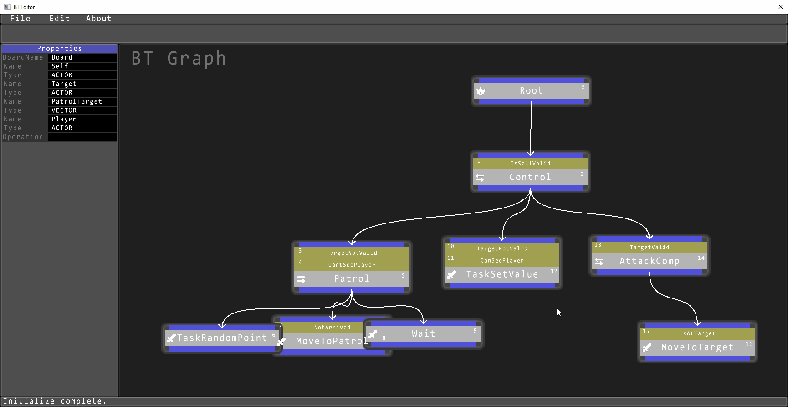

# Game AI Behavior Tree System  游戏AI行为树系统

A behavior tree system with eidtor\
一个游戏AI行为树编辑器

## Features:  功能展示: 
Game AIs with different behaviors: chase and attack, flee away.\
游戏内AI的不同行为：寻路，攻击以及逃跑
 

Game AI behavior: random patrol\
游戏内AI行为：随机寻路巡逻
 

Editor function: create task node, link node, create condition for node\
编辑器功能：可创建任务节点，逻辑节点，条件节点，可连接不同节点
 

Editor feature: moving, area selecting, zooming in or out, dragging graph, level of details on node\
编辑器功能：拖拽节点，区域选择，缩放，根据节点缩放大小自动lod渲染节点内容
 

Editor feature: editing values and supporting multiple data types on graph scratch board\
编辑器功能：支持黑板值的取值，判断与编辑，API修改
 

Editor feature: in-game debugging graph\
编辑器功能：游戏内DEBUG行为树节点执行逻辑
 

